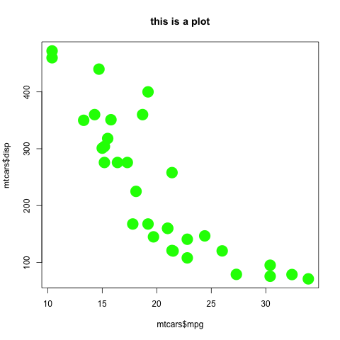

```{r, echo = FALSE}
#install.packages(english)
library(english)

```

# Baudrillardist hyperreality and socialist realism

## `r Sys.Date()`

\vspace{10mm}

## Authors

Judit Fiete Schultz^1^, Ursel Lenz Wiegand^2^, Kuno Alfreda Ackermann^2,3^

\vspace{10mm}

## Affiliations

^1^ Cloud Elementary for Empowering Dexterity

^2^ Dr Patrick Green's Upper School of Disease Control

^3^ Admiral Milton Atkinson's Military School for Paranormal Investigation

\vspace{10mm}

# Abstract

Before you start:

1)  Install LaTeX (if you haven't done so already)

    -   TinyTeX in R: tinytex::install_tinytex()

    -   MiKTeX on Windows - [http://miktex.org](http://miktex.org/ "http://miktex.org")

    -   MacTeX on macOS - <https://tug.org/mactex/>

2)  Press knit in the ribbon above to render this script into a manuscript. Alternatively press cmd + shift +k (mac) or ctrl + shift + k (windows).

3)  [If you want to learn how to use markdown, click here](https://www.markdownguide.org/basic-syntax/)

4)  To change the data and figures used in this script, open the file called `RMarkDown_Exercise_Script.R`. It is located in the same folder as this file (Mina_DSF \> Exercises \> Rmarkdown)

\newpage

# Introduction

We have added a code block to the manuscript. This can be useful if you want to incorporate figures or data into the manuscript. However, we define `echo = FALSE` .This way the code block is not visible in the output of the manuscript (though the output of the code block still is)

<br> It is also possible to add [hyperlinks](http://www.coveredbridgesociety.org/)

# Methods

Rmarkdown is also great for formulas because it can incorporate LaTeX. \textcolor{red}{Using LaTeX also allows us to change various layout features, such as text colour}.

$$
x = \frac{-b \pm \sqrt{b^2 - 4ac}}{2a}
$$

# Results

There are various ways to incorporate plots. Here I show a fairly complicated method (from LaTeX) that gives us much freedom. One of the advantages of this methods is that it allows us to reference the plot in text as Figure \ref{fig:scatterplot}. When new plots are added, the reference is updated automatically. A downside of using LaTeX to insert the image is that it looks for the best place to position the image. As a result, the image can sometimes end up away from the in-text reference. Here we use the `\clearpage` command to solve this issue. This command moves the text following the figure to the next page. This way LaTeX has ample space to position the figure.

Before knitting, change the text inside`\graphicspath``to the directory where your folder is located

```{=tex}
\begin{figure}[h]
  \centering
  \graphicspath{{/Users/au572919/Research/NMBU/MINA_DSF}}
  {\includegraphics[width=15cm]{./Exercises/RMarkdown/Figure1.png}}
  \caption{Here is a plot}
  \label{fig:scatterplot}
\end{figure}
```


This is another way to plot the same figure





The `knitr` function `knitr::include_graphics()` can also be used to insert figures. Howerver, I have not used it much myself.


\clearpage

We also show a table. One of the easiest ways to do so is by loading data frames into the environment and printing them. This is essentially what we do in the code block below. However, we use the `kable` function from the `knitr` package to make it look pretty. Once again, we use `echo = False` to make sure the code is not printed in the final manuscript.

```{r, echo = F}
library(knitr)
kable(head(mtcars), caption= "here is a caption")

```

# Discussion

We report on the characteristics of **`r nrow(mtcars)`** different cars. Note that we can also write this as plain text "we report on the characteristics of **`r as.character(as.english((nrow(mtcars))))`** different cars". In both cases, the number is not manually written by the author. Instead, it is R code. The written value in the Manuscript will thus change if the underlying data changes.

Here is a references that has nothing to do with cars [@abraham2019]. We can also add an text reference, such as the paper that @fiedel2018 wrote. These references are automatically added to the bottom of the manuscript. I personally work with Zotero, but you can add references from a variety of sources. To insert references, go to the visual editor. Then look for *insert* \> *citation.* Alternatively, you can type the `@` sign when working in the visual editor.

# References {#references .unnumbered}
