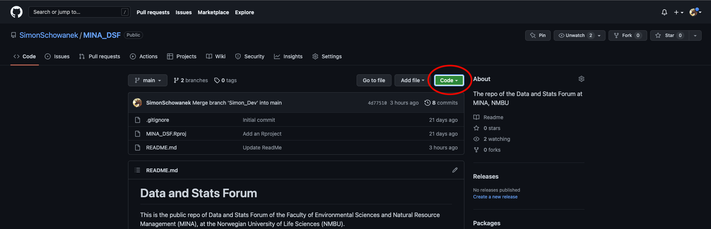

# Github Workshop Exercise

This is an exercise that will help you get familiar with Git and Github. In this exercise you will learn

1.  how to clone an existing repository
2.  How to create your own reposity
3.  How to make changes to repositories, including:
    -   how to commit, push and pull
    -   how to deal with merge conflicts
    -   How to integrate Git and Rstudio.

# 1. Clone an existing repository (and make changes).

## 1.1 Creating the directory

In this section you will learn how to clone an existing directory to your computer. In this case you will clone the [MINA DSF Github](https://github.com/SimonSchowanek/MINA_DSF).

1.  Go to the [MINA DSF Github](https://github.com/SimonSchowanek/MINA_DSF)
2.  Press the arrow next to the green "code" button

2.  Copy link
3.  Go to Rstudio
4.  Select *file \> new project \> version control \> git*
5.  Then
    -   Past the URL
    -   Create a directory name
    -   Select directory location (**Make sure you remember where you save the directory. This will become imporant**)
    -   Create Project
6.  Go to the directory location and check that the local directory has been created properly.

Well done. You have now copied the directory to your computer. This is the local directory in which you can make changes.

## 1.2 Opening the directory in GitKraken

Now that you have created the directory, you will want to open it in GitKraken. To open the directory in GitKraken:

1.  Open GitKraken

2.  If this is your first repo, a repository manager should appear. If this does not happen, select *file \> open repo*.

3.  Select *Open a Repository* and select the directory in which you have placed the local repository and press open. A github interface should now appear.

## 1.3 Making changes to the directory

Once you can open the directory in GitKraken you will want to make changes to it. Here you will learn how to make changes to a local directory and learn how to how to push them to a remote repository (i.e. GitHub).

### Changing and Adding Files

1.  In GitKraken, make sure the MINA DSF directory is open (Check what it is saying in the topleft corner, under repository. Press the little arrow to view all available repositories).

2.  Right click on the main branch and select *Create Branch Here*. Select a branch name. You want to name it something that is meaningful to you and your collaborators. For the sake of this exercise, we will call this branch your "personal branch". You have now created a new branch for you to work in (= "personal branch"). You can switch to any other branch by selecting the branch you work on in the topleft corner of your screen.

3.  For now, double check that you are working on your "personal branch" and NOT on the main branch. If you are working on the main branch you make changes directly to the "clean files" which you want to avoid. In addition, certain files or changes may not be visible if you have been working on them earlier but have not merged them with the main branch yet.

4.  Go to Rstudio by going to your repository and opening the Rproject within. Opening the project directly ensures that you are working in right repository and not the one previously opened in Rstudio.

5.  Open *Rscript.R*. Write your name as a comment (or anything else you want to write) and save the file.

6.  Move back to GitKraken. You will see that new changes have appeared (the orange pencil above the tip of your branch).

7.  Look at the "Unstaged" window, at the right side of your screen. This window will show all the changes that have been made to the files that have not been staged yet. You can click on the file names to inspect which changes have been made. When you are satifisfied with the changes click on *Stage all changes* to stash them. The files will now move to the *staged* window. These are the files that have received the "mark of approval" to be commited.

8.  In the *Commit Message* window below, provide a brief summary of the changes that you have made. Make it brief but informative to you and your collaborators. If you want to provide more detail about the changes you have mode you can write a lengthier explanation in the *description* box.

At this point, you have made changes to the files, and you have staged them (i.e. saved them locally on your computer). However, no changes have been made to the remote repository, and nothing has been saved online. As a result, the changes you made are NOT yet visible on the remote repository. They will only become visible once you commit the files. We will do so next

### Viewing Changes

1.  Go to the [MINA DSF Github](https://github.com/SimonSchowanek/MINA_DSF) and make sure you are viewing your "personal branch" (GitHub will resort to the main branch everytime you reload). Click on *Rscript.R* or any other file you have modified. Notice how changes you made are not yet visible. This is because the files have been *staged* but they have not yet been *committed*. As said, the changes will only become visible on the remote repository after you have *committed* them AND have pushed them to the remote repository.

2.  Go back to GitKraken and commit the changes you made earlier to the GitHub repository. You will see that that your local branch will move ahead of the remote repository (the little computer symbol will be above your github profile picture). This means that the changes you made on your computer have not yet been uploaded to the remote repository.

3.  To upload the changes you made in your local repository press *push* (the upwards pointing arrow in the top centre ribbon). This will send your committed changes to the remote repository. They are now visible to your collaborators if they are viewing the branch you are working on the remote repository. The changes will not be visible in any other branch until your branch is merged with said other branch. At this point you have "saved your changes" online, but you have not "merged" them into the rest of the project.\

4.  Go to Rstudio and make an R-script where you post a link to your favourite wikipedia page as a comment. Save the Rscript in the *exercise scripts* folder which you will find the in the *exercise* folder in the Repository" (so --\> Respository_Name/Exercises/Exercise Scripts/YourRScript.R).

5.  Go to the [MINA DSF Github](https://github.com/SimonSchowanek/MINA_DSF) and make sure the branch you are viewing your "personal branch". Click on *Rscript.R* or any other file you have modified. Notice how the changes you made and the Rscript you created are now visible when looking at your branch. Now select the main branch and inspect the file again. You will notice that neither the changes you made nor the script you created are visible here. This is because you haven't merged your development branch with the main branch yet.

6.  Go to Gitkraken and make sure you are working on your "personal branch". Then move to finder (mac) or file explorer (windows) and open your repository. Inspect your any changes you made to Rscript.R as well as the Rscript you added yourself. Next, move back to Gitkraken and change the repository to main. Once again, open the repository in finder or file explorer. You will see that the changes you made to Rscript.R or no longer visible, nor is R-script you added visible. This is because you are now working on the main branch, where these changes have not yet been incorporated. **You should always be mindful of which branch you are working on, because the branch you are working on determines which files you can see, as well as their version**

7.  Go to GitKraken. Make sure you are on your "personal branch". Select your branch and pull it into the main branch. Select *merge "your_branch" into main*. Your changes have now been incorporated into the main branch. You will see that your local branch (the little computer symbol) has moved ahead of the remote branch (your github profile picture) this mean that the main branch on your computer is ahead of the main branch of the remote repository (i.e. you collaborators will not be able to see your changes yet). Push the changes to the remote repository to resolve this. You can either right click on the local main branch and select push, or you can move to the main branch and press push at the top centre.

8.  Go to the [MINA DSF Github](https://github.com/SimonSchowanek/MINA_DSF) and make sure you are viewing the main branch. Click on *Rscript.R*. You will see that the changes you made are now visible on the main branch. Likewise, the changes you made to Rscript.R and the R-script you added will now also be visible in finder/file explorer when you are working on the main branch.

### Pulling changes made by other collaborators

While you were working on the script, other people have also been making changes (which means that you are now looking at outdated files). To download all these changes, go to the main branch and select *pull* (the downwards pointing arrow in the top centre area). This will update your main branch. However, keep in mind that you have now only updated the files in your main branch. The files in your development branch are still outdated. To solve this, merge the main branch into your development branch.

# 2. Create a directory for one of your projects

If you want to create a repository for an existing Rproject, have a look at these instructions by [happygitwithr](https://happygitwithr.com/existing-github-first.html). If you want to create a new project altogether it may be easier to start by creating a github repository and cloning it to your computer, like you did in the previous exercise.
